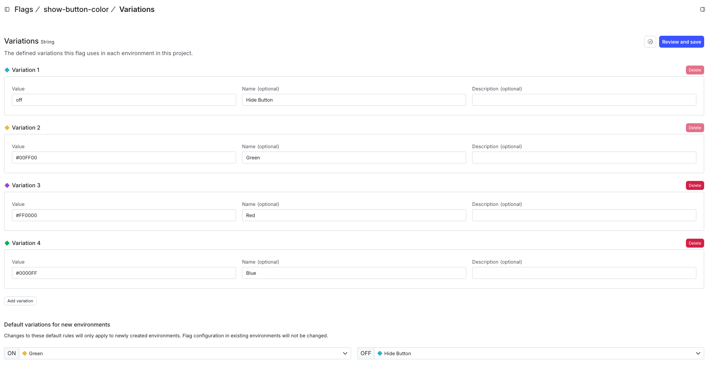
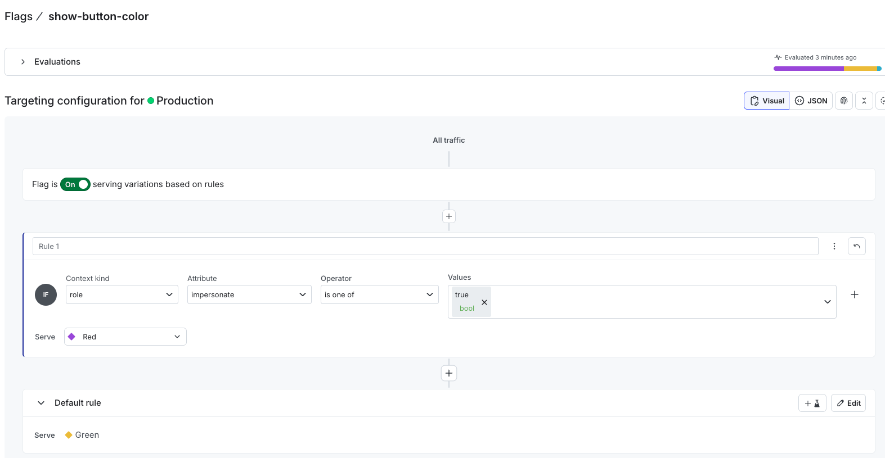
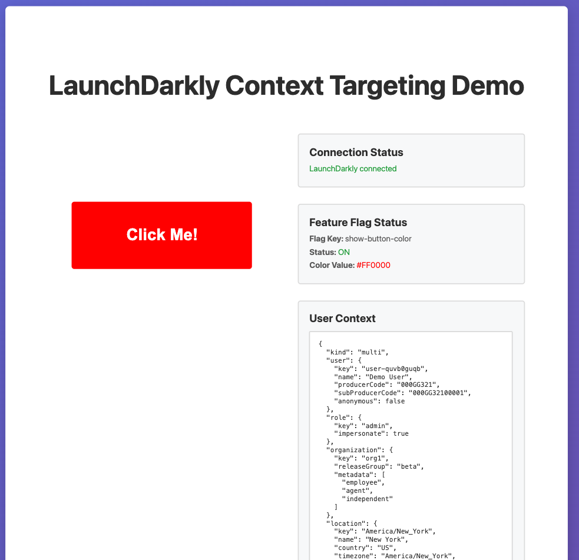

# LaunchDarkly Feature Flag Example

A simple example demonstrating LaunchDarkly client-side context usage with a feature flag button that appears/disappears and changes color based on the `show-button-color` flag.

## About Contexts

**Contexts** are the foundation of LaunchDarkly's targeting system. They represent the entities (users, organizations, devices, etc.) that interact with your application and contain attributes that LaunchDarkly uses to evaluate feature flags. Contexts enable you to:

- **Target** specific variations based on context attributes (e.g., role, email domain, location)
- **Create segments** to group contexts together for easier targeting
- **Use multi-contexts** to evaluate flags based on multiple entity types simultaneously
- **Build sophisticated targeting rules** that go beyond simple user-based targeting

This example uses user contexts to demonstrate how LaunchDarkly evaluates flags and serves different variations based on context data. To learn more about contexts, read the [LaunchDarkly Contexts Introduction](https://launchdarkly.com/docs/home/flags/contexts/intro).

## Setup

1. Install dependencies:
```bash
npm install
```
2. Create a feature flag in LaunchDarkly:
   - Flag key: `show-button-color`
   - Flag type: **String**
   - Create 4 variations:
     - Variation 1: Green - Set value to `#00ff00`
     - Variation 2: Red - Set value to  `#ff0000`
     - Variation 3: Blue - Set value to `#0000ff`
     - Variation 4: Off - Set value to `off` - The button will not be displayed
   
   
   
   - When ON: Set the value to a hex color variation
   - When OFF: Set the value to `off` or leave empty - The button will not be displayed

3. Update the LaunchDarkly Client ID in `main.js`:
   - Open `main.js` and replace `'your-client-id-here'` with your actual LaunchDarkly Client ID. Get your Client ID from the main landing page by clicking the 3dots next to the environment you're working on for a drop down.
   <inser image here>

4. Run the development server:
```bash
npm run dev
```

5. Open the URL shown in the terminal `http://localhost:5173`

## How it works

- When the `show-button-color` flag is **OFF**: The button is hidden
- When the `show-button-color` flag is **ON**: The button is displayed with the color specified in the flag value (hex color code)

## Learning Context Targeting

Now that your flag is set up, let's explore how LaunchDarkly uses context to target different variations:

1. **Target by Custom Role**: 
   - In your flag's targeting rules, create a rule that targets contexts with a custom role attribute
   - Set the variation to show a specific color (e.g., Green for admins, Blue for users)


2. **Test with Impersonation**:
   - Use LaunchDarkly's impersonation feature to test different context values
   - Set impersonation to `true` and assign the Red variation to see how targeting works
   - 
   - 

3. **Explore Different Context Types**:
   - Try creating contexts with different attributes (roles, email domains, user segments, etc.)
   - Experiment with new context keys to see how LaunchDarkly evaluates and targets based on context data

